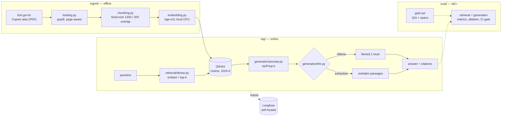

# rag-eval

**A production-grade RAG system over Brazilian financial regulatory documents, built around an evaluation harness rather than a demo.**

The corpus is the public minutes of the **Copom** — the Brazilian Central Bank's monetary policy committee — 30 documents (`atas`) in Portuguese covering the Selic rate decisions from October 2022 to June 2026. Everything runs locally and costs nothing: local embeddings, a local vector store, a local LLM (or a no-LLM extractive mode — see below), self-hosted tracing. There is no paid API and no API key anywhere in this repo.

The point of the project is not the RAG pipeline. Plenty of those exist. The point is the part almost all of them skip: **measuring whether it actually works**, separately for retrieval and generation, with a versioned gold set and an ablation that proves each component earns its place. This repo also doubles as the core of a master's thesis.

> Current milestone: **M1 — naive baseline.** It is deliberately unoptimised. It is the number the rest of the project has to beat.

---

## Architecture



Repository layout follows the project spec (`docs/spec.md`):

| path | role |
|---|---|
| `ingest/` | corpus download, PDF loading, chunking, embedding |
| `retrieval/` | Qdrant access; dense retriever (hybrid + reranking arrive in M4) |
| `generation/` | prompt, LLM backends, cited answers |
| `rag/` | config, tracing, the pipeline, the CLI |
| `eval/` | gold dataset + (from M3) metrics, report, regression gate |
| `serving/` | FastAPI + UI placeholder (M7) |
| `docs/` | the spec of record |

---

## Stack

| layer | choice | why |
|---|---|---|
| Vector store | **Qdrant** (Docker) | open, self-hosted, good metadata filtering for M4/M5 |
| Embeddings | **bge-m3** via `sentence-transformers` | multilingual, strong on Portuguese, runs on CPU |
| LLM | **Ollama** (`llama3.1`), with an extractive fallback | free, local, no vendor lock-in |
| Tracing | **Langfuse v2** (Docker) | open, self-hosted; v2 needs only Postgres |
| Config | `pydantic-settings` | one `.env`, no hardcoded hosts |

Everything above is free and runs on a laptop. The narrative angle is deliberate: *"open models, no vendor lock-in"* is a strength, not a compromise.

---

## Running it

### 1. Infrastructure

```bash
docker compose up -d
docker compose ps          # all three must report (healthy)
```

- Qdrant dashboard → <http://localhost:6333/dashboard>
- Langfuse → <http://localhost:3000> (login `local@rag-eval.dev` / `ragevallocal123`)

The Langfuse project and its API keys are auto-provisioned on first boot via
`LANGFUSE_INIT_*`, so tracing works without clicking through the UI.

### 2. Python environment

```bash
uv sync
cp .env.example .env      # optional; every default already points at the local stack
```

### 3. Corpus + ingest

```bash
uv run python -m ingest.pipeline --download 30
```

Downloads 30 Copom minutes into `data/raw/` (gitignored), writes the committed
`data/manifest.json`, chunks, embeds with bge-m3 on CPU, and upserts into Qdrant.
First run also pulls ~2 GB of model weights from HuggingFace. Re-running is
idempotent — already-downloaded PDFs are skipped.

Only the manifest is committed. The corpus is reproducible from it, so no binaries
enter git.

### 4. Ask

```bash
uv run python -m rag.ask "qual a decisao do Copom sobre a Selic?"
uv run python -m rag.ask --top-k 8 --show-passages "quais as expectativas do Focus para 2026?"
uv run python -m rag.ask --mode extractive --json "quem votou pela decisao da 279a reuniao?"
```

Flags: `--top-k`, `--mode {auto,ollama,extractive}`, `--show-passages`, `--json`,
`--no-trace`.

Every call emits a Langfuse trace named `rag.ask` with a `retrieve` span (the ranked
hits) and a `generate` span (the answer and token usage), tagged with the prompt
version, embedding model, chunk settings and LLM backend — so a number can always be
traced back to the configuration that produced it.

---

## LLM mode: which one shipped

Two backends sit behind one interface (`generation/llm.py`):

- **`ollama`** — a local Ollama server. Free, no key, no cloud call.
- **`extractive`** — no language model at all. Returns the retrieved passages
  *verbatim*, each with its citation.

`--mode auto` (the default) probes Ollama once and degrades to extractive if it is
not reachable, so the same command works on any machine.

### What shipped in M1: **extractive mode**

Ollama itself **is installed** on the dev machine (`winget install Ollama.Ollama`,
v0.32.5, server reachable on `:11434`). What did not complete is the *model pull*:
both `llama3.1` (4.9 GB) and `qwen2.5:3b` (1.9 GB) download to ~95–97 % and then
stall with zero throughput, repeatedly, against an otherwise healthy connection —
the same machine pulled 7 GB of HuggingFace weights and 30 PDFs without trouble in
this same session. That is an environment problem, not a code problem, so it was not
worth grinding on.

So **M1 ships in extractive mode**, and every observation reported below was produced
with it. The
Ollama backend is fully implemented and exercised by the same interface; finishing it
is one successful command away:

```bash
ollama pull llama3.1               # or qwen2.5
uv run python -m rag.ask --mode ollama "..."   # --mode auto picks it up automatically
```

No code change is required — `build_llm("auto")` probes `:11434/api/tags` and
switches backends on its own.

The extractive backend is not a stopgap to be embarrassed about — it is the honest
floor for groundedness. A verbatim quote cannot hallucinate, so it is a useful
control arm in the M3 harness: it isolates *retrieval* quality from *generation*
quality, which is exactly the separation this project is built to measure.

---

## Current status

| milestone | state | evidence |
|---|---|---|
| **M0 — scaffolding** | done | `docker compose ps` reports Qdrant, Langfuse and Postgres `(healthy)` |
| **M0 — corpus** | done | 30 Copom minutes (Oct 2022 → Jun 2026), 194 text pages, in `data/manifest.json` |
| **M0 — ingest** | done | **636 chunks**, bge-m3 1024-d, embedded on CPU in ~135 s (4.7 chunks/s) |
| **M1 — baseline** | done | `rag.ask` answers end to end with citations |
| **M1 — tracing** | done | `rag.ask` traces visible in Langfuse with `retrieve` + `generate` spans |
| **M1 — gold seed** | draft | 10 candidate Q/A pairs, **pending human validation** |
| M2 → M8 | not started | — |

### What the baseline actually does (observed, not claimed)

Two example queries, `--mode extractive --top-k 3`:

- *"quais eram as expectativas de inflação do Focus para 2026 e 2027?"* → retrieves
  **page 3 of three different atas** — the right *kind* of paragraph every time, but
  from November 2024, June 2024 and May 2024 rather than the 2026 meetings that
  actually carry those figures.
- *"qual a decisão do Copom sobre a Selic na reunião de junho de 2026?"* → retrieves
  the "Decisão de política monetária" paragraph from the 264th, 267th and 260th
  meetings. Right section, wrong meeting.

That failure mode is the whole point of shipping a naive baseline: dense similarity
finds the right *topic* and is blind to the *date*, because every ata phrases these
paragraphs almost identically. It is a concrete, measurable target for M4 — metadata
filtering on `reference_date`, hybrid retrieval so the meeting number is matched
lexically, and reranking. No number below is claimed until M3 measures it properly.

### What is deliberately naive

M1 is the baseline, so it does the dumbest reasonable thing at every step:

- **Fixed-size character chunking** (1200 chars, 200 overlap), split per page so every
  chunk can cite a page number. No semantic or structural splitting.
- **Dense retrieval only.** No BM25, no hybrid fusion, no reranking, no query rewriting.
- **Stuff-the-context prompting.** Top-k passages concatenated, one shot, temperature 0.
- **No evaluation numbers yet.** The gold set is a draft; publishing a metric against
  an unvalidated reference would be theatre.

Each of those is a knob M4 turns one at a time, with a measured delta. That ablation
is the scientific core of the project — not the pipeline itself.

---

## Next milestone — M2: the gold set

`eval/datasets/gold_seed.jsonl` holds **10 draft Q/A pairs**, each with source
document, page and span, covering single-hop lookup, numeric and list extraction,
scenario-qualified lookup, multi-hop within a document, reverse lookup, and one
deliberate out-of-scope negative.

It is marked **DRAFT — PENDING HUMAN VALIDATION** and it means it. The rows were
drafted by an agent from the ingested text; none has been checked against the source
PDF by a human. An agent-written, agent-graded gold set measures nothing. The
validation protocol is in `eval/datasets/README.md`; M2 expands the set to 50–100
validated rows, and only then does M3 produce a number worth reporting.

Roadmap after that: **M3** harness (retrieval vs generation metrics, calibrated
LLM-judge) → **M4** ablation (hybrid, reranking, chunking) → **M5** guardrails and
governance → **M6** CI regression gate → **M7** serving → **M8** writeup.

---

## Data and licensing

Corpus: *Atas do Copom*, published by the Banco Central do Brasil at
[bcb.gov.br](https://www.bcb.gov.br/publicacoes/atascopom) — public information,
free to use. `data/manifest.json` records the URL, title, reference date and SHA-256
of every document, so the corpus is reproducible without redistributing it.

Code: MIT.
