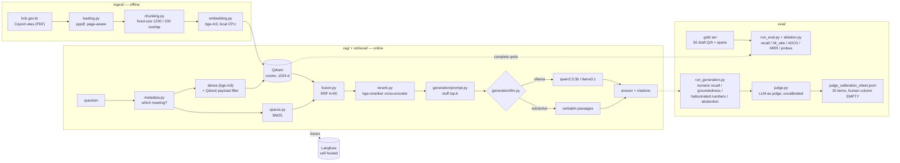

# rag-eval

**A production-grade RAG system over Brazilian financial regulatory documents, built around an evaluation harness rather than a demo.**

The corpus is the public minutes of the **Copom** — the Brazilian Central Bank's monetary policy committee — 30 documents (`atas`) in Portuguese covering the Selic rate decisions from October 2022 to June 2026. Everything runs locally and costs nothing: local embeddings, a local vector store, a local LLM (or a no-LLM extractive mode — see below), self-hosted tracing. There is no paid API and no API key anywhere in this repo.

The point of the project is not the RAG pipeline. Plenty of those exist. The point is the part almost all of them skip: **measuring whether it actually works**, separately for retrieval and generation, with a versioned gold set and an ablation that proves each component earns its place. This repo also doubles as the core of a master's thesis.

> Current milestone: **M4 — retrieval ablation.** The naive M1 baseline measured
> **MRR 0.191 / hit@5 0.367**. Seven measured retrieval arms later it is
> **MRR 0.741 / hit@5 0.959**, and the defect that caused it — returning the right
> paragraph from the *wrong Copom meeting* — is closed on all 41 gold questions that
> name their meeting. The interesting part is which component did it: not the
> cross-encoder reranker (which costs 2.2 s of latency and does not pay for itself),
> but a regex that reads the date out of the question. Full numbers and the
> controlled contrasts: **[`docs/ablation.md`](docs/ablation.md)**.

---

## Architecture



Repository layout follows the project spec (`docs/spec.md`):

| path | role |
|---|---|
| `ingest/` | corpus download, PDF loading, chunking, embedding |
| `retrieval/` | Qdrant access, BM25, RRF fusion, meeting-metadata resolution, cross-encoder reranking, and the named ablation arms |
| `generation/` | prompt, LLM backends, cited answers, the LLM judge |
| `guardrails/` | PII detection + masking (with Brazilian recognisers), injection detection, the governed query path |
| `governance/` | document ACL as a Qdrant payload filter, append-only audit log |
| `rag/` | config, tracing, the pipeline, the CLI |
| `eval/` | gold dataset, metrics, the harnesses (`run_eval`, `ablation`, `run_generation`, `calibration`), reports |
| `serving/` | FastAPI + UI placeholder (M7) |
| `docs/` | the spec of record, `ablation.md` |

---

## Stack

| layer | choice | why |
|---|---|---|
| Vector store | **Qdrant** (Docker) | open, self-hosted; its payload filter is what M4's meeting filter and M5's ACL both compile down to |
| Embeddings | **bge-m3** via `sentence-transformers` | multilingual, strong on Portuguese, runs on CPU |
| Sparse retrieval | **BM25, written in-repo** | forty lines of arithmetic; an ablation is more defensible when the thing it compares against is visible rather than behind a dependency pin |
| Reranker | **bge-reranker-base** (local cross-encoder) | multilingual (XLM-R based), a third the size of `v2-m3`, CPU-viable |
| LLM | **Ollama** (`qwen2.5:3b`, `llama3.1`), with an extractive fallback | free, local, no vendor lock-in |
| Judge | **Ollama**, a *different* model from the generator | grading your own homework has a known direction of bias |
| Tracing | **Langfuse v2** (Docker) | open, self-hosted; v2 needs only Postgres |
| Config | `pydantic-settings` | one `.env`, no hardcoded hosts |

Everything above is free and runs on a laptop. The narrative angle is deliberate: *"open models, no vendor lock-in"* is a strength, not a compromise.

---

## Running it

### 1. Infrastructure

```bash
docker compose up -d
docker compose ps          # all three must report (healthy)
```

- Qdrant dashboard → <http://localhost:6333/dashboard>
- Langfuse → <http://localhost:3000> (login `local@rag-eval.dev` / `ragevallocal123`)

The Langfuse project and its API keys are auto-provisioned on first boot via
`LANGFUSE_INIT_*`, so tracing works without clicking through the UI.

### 2. Python environment

```bash
uv sync
cp .env.example .env      # optional; every default already points at the local stack
```

### 3. Corpus + ingest

```bash
uv run python -m ingest.pipeline --download 30
```

Downloads 30 Copom minutes into `data/raw/` (gitignored), writes the committed
`data/manifest.json`, chunks, embeds with bge-m3 on CPU, and upserts into Qdrant.
First run also pulls ~2 GB of model weights from HuggingFace. Re-running is
idempotent — already-downloaded PDFs are skipped.

Only the manifest is committed. The corpus is reproducible from it, so no binaries
enter git.

### 4. Ask

```bash
uv run python -m rag.ask "qual a decisao do Copom sobre a Selic?"
uv run python -m rag.ask --top-k 8 --show-passages "quais as expectativas do Focus para 2026?"
uv run python -m rag.ask --mode extractive --json "quem votou pela decisao da 279a reuniao?"
```

Flags: `--top-k`, `--mode {auto,ollama,extractive}`, `--show-passages`, `--json`,
`--no-trace`.

### 5. Measure

```bash
# retrieval, one named arm (default `dense` — the committed baseline)
uv run python -m eval.run_eval --min-status draft --out eval/reports/baseline_dense.json
uv run python -m eval.run_eval --config hybrid+rerank+metadata

# the full M4 ablation: seven arms, controlled contrasts, wrong-meeting probes
uv run python -m eval.ablation --out eval/reports/ablation.json

# generation: three backends, deterministic metrics + LLM judge + calibration sheet
uv run python -m eval.run_generation --out eval/reports/generation.json

# guardrails: injection ASR, PII leak, abstention, ACL — each vs an ungoverned arm
uv run python -m eval.run_eval --suite adversarial

# judge-vs-human agreement, once the sheet has been labelled
uv run python -m eval.calibration

uv run pytest -q
```

`run_eval` flags: `--gold`, `--min-status {draft,validated}`, `--config`,
`--k 1,3,5,10`, `--out`, `--label`, `--quiet`.

Two defaults are deliberately different and worth stating, because getting them
backwards would quietly corrupt every before/after number in this repo:

- **`eval.run_eval` defaults to `--config dense`.** That command produced the
  committed M1/M2 baseline and has to keep producing it. If it silently upgraded
  to the best arm, the "before" half of every comparison would move.
- **`rag.ask` and the serving path default to `hybrid+rerank+metadata`**
  (`settings.retrieval_config`), the M4 winner. Serving should use the best thing
  measured.

`--min-status` is the flag that matters most. Today everything is `draft`, so
`--min-status draft` exercises the harness and `--min-status validated` returns
nothing (by design, and exit code 3). After the human validation pass, the same
command with `--min-status validated` produces the number that counts — the
validation is a re-run, not a rewrite.

Every call emits a Langfuse trace named `rag.ask` with a `retrieve` span (the ranked
hits) and a `generate` span (the answer and token usage), tagged with the prompt
version, embedding model, chunk settings and LLM backend — so a number can always be
traced back to the configuration that produced it.

---

## LLM mode: which one shipped

Two backends sit behind one interface (`generation/llm.py`):

- **`ollama`** — a local Ollama server. Free, no key, no cloud call.
- **`extractive`** — no language model at all. Returns the retrieved passages
  *verbatim*, each with its citation.

`--mode auto` (the default) probes Ollama once and degrades to extractive if it is
not reachable, so the same command works on any machine.

### Generative mode landed in M3

M1 shipped in extractive mode only, because both model pulls stalled at ~95–97 %
against an otherwise healthy connection. Retried in the M3 session, both completed
without incident — `qwen2.5:3b` (1.9 GB) and `llama3.1:8b` (4.9 GB) are now local.
No code changed: `build_llm("auto")` probes `:11434/api/tags` and switches backends
on its own, exactly as M1 said it would.

Both are evaluated as arms in `eval/run_generation.py`, alongside extractive.

The extractive backend stays, and not as a stopgap — it is the **groundedness
floor**. A verbatim quote cannot hallucinate, so it bounds what generation can be
blamed for and isolates *retrieval* quality from *generation* quality, which is the
separation this project exists to measure. It also has one hard limitation the
report makes explicit: it cannot abstain, because it has no mechanism to say
anything other than what it retrieved.

---

## Current status

| milestone | state | evidence |
|---|---|---|
| **M0 — scaffolding** | done | `docker compose ps` reports Qdrant, Langfuse and Postgres `(healthy)` |
| **M0 — corpus** | done | 30 Copom minutes (Oct 2022 → Jun 2026), 194 text pages, in `data/manifest.json` |
| **M0 — ingest** | done | **636 chunks**, bge-m3 1024-d, embedded on CPU in ~135 s (4.7 chunks/s) |
| **M1 — baseline** | done | `rag.ask` answers end to end with citations |
| **M1 — tracing** | done | `rag.ask` traces visible in Langfuse with `retrieve` + `generate` spans |
| **M2 — gold set** | draft | **56 Q/A pairs**, 24 documents cited, **pending human validation** |
| **M2 — eval harness** | done | `eval/run_eval.py` |
| **M2 — baseline measured** | done | `eval/reports/baseline_dense.json` — MRR 0.191 |
| **M4 — retrieval ablation** | done | `eval/reports/ablation.json`, [`docs/ablation.md`](docs/ablation.md) — 7 arms, MRR 0.191 → 0.741 |
| **M3 — generative mode** | done | `qwen2.5:3b` + `llama3.1` local; `eval/reports/generation.json` |
| **M3 — judge calibration** | **awaiting human** | `eval/datasets/judge_calibration_sheet.jsonl` — 30 items, human column empty |
| **M5 — guardrails + governance** | done | `eval/reports/adversarial.json`, [`docs/governance.md`](docs/governance.md) |
| M6 → M8 | in progress | — |

### The M1 baseline — what M4 had to beat

Dense retrieval only, bge-m3, 636 chunks, 49 answerable gold rows, macro-averaged:

| metric | @1 | @3 | @5 | @10 |
|---|---|---|---|---|
| `recall` | 0.053 | 0.085 | 0.149 | 0.194 |
| `hit_rate` | 0.082 | 0.204 | 0.367 | **0.531** |
| `nDCG` | 0.071 | 0.098 | 0.138 | 0.161 |

**MRR = 0.191.** For 47% of gold questions, ten retrieved chunks contained nothing
relevant at all.

The diagnosis was not subtle: **dense similarity found the right topic and was
blind to the date.** Every ata phrases its decision paragraph near-identically, so
asked about June 2026 the baseline would happily return March 2025's copy. On the
41 questions that *named their meeting outright*, it got the right meeting at rank
1 exactly **4 times**.

### What M4 did about it, and what it cost

| arm | MRR | hit@5 | rank-1 correct meeting | p95 ms |
|---|--:|--:|--:|--:|
| `dense` (M1 baseline) | 0.191 | 0.367 | 0.098 | 7 |
| `bm25` | 0.382 | 0.592 | 0.927 | 0.5 |
| `hybrid` | 0.381 | 0.510 | 0.341 | 7 |
| `hybrid+rerank` | 0.342 | 0.510 | 0.195 | 2553 |
| **`hybrid+rerank+metadata`** | **0.741** | **0.959** | **1.000** | 2217 |

Three findings, none of which a leaderboard would have shown — which is why the
arms are laid out as **controlled pairs differing in one component** rather than as
a cumulative ladder:

1. **The cheapest component won by an order of magnitude.** Resolving the meeting
   named in the question and applying it as a Qdrant payload filter is ~120 lines
   of regex. It moved MRR **+0.498** on the bare baseline, at *negative* latency
   cost, with **41/41 hint precision** (zero false positives — the number that
   licenses using it as a hard filter instead of a soft boost).
2. **The expensive, fashionable component did not pay for itself.** The
   cross-encoder reranker costs **+2.2 s of p95 latency** and is *actively harmful*
   without the metadata filter (MRR −0.039, rank-1 meeting accuracy −0.146): it
   reorders by semantic fit, and semantic fit is precisely the signal that cannot
   tell two Copom meetings apart. With the filter it is +0.005 MRR. In a system
   with a latency budget it would be cut.
3. **Fusing a strong arm with a weak one drags the strong one down.** BM25 alone
   gets 0.927 rank-1 meeting accuracy; fused with dense (0.098) it gives 0.341. RRF
   weights arms equally, which is the wrong prior when one is near-random on the
   decisive axis.

The honest remaining gap is **reverse lookup** — questions that name no meeting and
must identify one from content ("*Em qual reuniao a Selic foi reduzida para 12,75%
a.a.?*"). Metadata filtering structurally cannot help, and 4 of 8 still rank the
wrong ata first. All four have the right document in the top 5, so it is a ranking
failure rather than a retrieval one.

Full numbers, per-metric deltas, latency, probe definitions and limits:
**[`docs/ablation.md`](docs/ablation.md)**.

**Caveat, and it is not a small one:** every number above is computed against a
gold set no human has validated. Relative movement between arms on a fixed
question set is the defensible reading; absolute levels are not.
`--min-status validated` is what changes that.

### What is still deliberately naive

M4 turned the retrieval knobs. These are untouched, on purpose, so they remain
available as future ablation arms rather than as unmeasured changes:

- **Fixed-size character chunking** (1200 chars, 200 overlap), split per page so
  every chunk can cite a page number. No semantic or structural splitting, and
  chunk size was held fixed across all seven arms.
- **Stuff-the-context prompting.** Top-k passages concatenated, one shot,
  temperature 0. No query rewriting, no multi-step retrieval.
- **Unweighted RRF at k=60**, the constant from the original paper. Tuning it
  against a 49-row draft gold set would be fitting noise and calling it a result.

---

## The gold set, and the one thing an agent must not do

`eval/datasets/gold_seed.jsonl` holds **56 draft Q/A pairs** citing 24 of the 30
documents: single-hop lookup, numeric extraction (Focus expectations, the Copom's
own projections, reference-scenario assumptions), list extraction including both
halves of a 5–4 split vote, multi-hop within a document, 8 reverse-lookup probes
and 7 out-of-scope negatives.

Every span was extracted from the actually ingested text and re-verified
programmatically before being written: the span must be locatable in a chunk of
its document on its page, the `source_doc_id` must exist in `data/manifest.json`,
the title must match the manifest verbatim. So the rows are **grounded**.

They are not **validated**, and the distinction is the whole point. A span can be
real and the question built on it still be ambiguous, mis-scoped, or answerable
from three other atas. Checking that is a human job — Rodrigo's — and it is the
scientific asset of this project. An agent-written, agent-graded gold set measures
nothing, so `"status": "validated"` is a flag no agent sets; there is a test in
`tests/test_gold.py` that fails if one ever does.

The protocol is in `eval/datasets/README.md`. Until it has been run, every number
in this README is a harness smoke test wearing a lab coat.

### Generation: what the numbers say — and what the judge does not

Three backends over all 56 gold rows, sharing one retrieval pass so arm
differences are generation differences only ([`docs/generation.md`](docs/generation.md)):

| arm | numeric recall | groundedness | hallucinated numbers | abstention ok | false refusal |
|---|--:|--:|--:|--:|--:|
| `extractive` | **0.913** | **0.988** | **0.000** | **0.000** | 0.000 |
| `qwen2.5:3b` | 0.777 | 0.838 | **0.000** | 1.000 | 0.082 |
| `llama3.1` | 0.826 | 0.907 | **0.000** | 1.000 | 0.041 |

- **Zero hallucinated numbers across all 168 answers.** No arm asserted a rate
  that was not in the retrieved evidence or the question.
- **The mode with the best groundedness cannot say "I don't know".** `extractive`
  wins numeric recall and groundedness and scores **0.000 on abstention** — on all
  seven out-of-scope questions it returned five passages of Copom minutes as
  though they were an answer. A dashboard ranking backends on groundedness alone
  would have picked exactly the wrong one.
- **Abstention is not free.** Both generative arms refuse correctly on all seven
  negatives and pay for it with false refusals on answerable questions (qwen 8.2%,
  llama 4.1%).

And the part that matters most for a project about evaluation:

> **Two local LLM judges agree on faithfulness only 44% of the time (Cohen's
> κ = 0.138).** Barely better than chance. On top of that, the judge in the first
> run *was* `llama3.1` and it graded its own arm's answers — rating them highest.
> Both facts are measured and recorded in the report (`judge_is_generator`,
> `judge_self_preference_warning`, `agreement.judge_vs_judge2`), not waved at.

So the judge's faithfulness column carries almost no information, and the
deterministic metrics are the ones to believe. This is exactly why the harness
computes arithmetic first and treats the judge as the flexible, suspect
instrument — and why the human gate below exists.

### Guardrails and governance: measured against a control arm

Four controls, each with an ungoverned arm running the identical attacks
([`docs/governance.md`](docs/governance.md)):

| metric | governed | ungoverned |
|---|--:|--:|
| **injection attack success** (24 attacks) | **8.3%** | 16.7% |
| — direct surface | 11.1% | 16.7% |
| — **indirect surface** (poisoned passage) | **0.0%** | 16.7% |
| **PII output leak** (corpus-supplied) | **0.0%** | **100.0%** |
| PII false positives on clean domain queries | 0.0% | — |
| abstention correctness / false refusal | 100% / 4.1% | — |
| **restricted chunks retrieved by an uncleared user** | **0** | — |

- **8.3%, not 0%.** Two attacks defeat the stack, both named in the writeup. A
  security section opening with 0% is either testing weak attacks or not being
  straight. The residual is a precision/recall property of a pattern-based
  detector, not a bug a longer regex fixes.
- **The indirect surface is where the guardrail earns its place** — 0.0% vs
  16.7%. Injection carried by a *retrieved document* is the RAG-specific attack,
  and a system that only inspects the user's question has no defence against it.
- **Presidio misses the CPF entirely.** Measured, not assumed — so
  `guardrails/brazilian.py` adds CPF/CNPJ/CEP/phone recognisers that validate
  **check digits**, not shape. Shape matching would redact `123.456.789-00`,
  which is not a CPF, and every question here is dense with numbers.
- **The ACL is a Qdrant payload filter inside the query, not a post-filter.** A
  post-filter has already read the restricted document; it also leaks *how many*
  matched via the result-list length. Proven with a live-Qdrant test that asks
  for 200 results and gets zero restricted ones — and still zero when the query
  is aimed directly at a restricted meeting.
- **The audit log deliberately stores the masked query and a SHA-256 of the raw
  one** — never the raw query, the answer, or a matched PII substring. A log that
  stores them is a second copy of what the masker exists to contain, with broader
  read access.

The ACL classification is **synthetic** (these are public BACEN documents; the
five most recent meetings stand in for a publication embargo) and every report
says so.

### The second human gate: judge calibration

`eval/datasets/judge_calibration_sheet.jsonl` holds **30 judged answers with
`human_faithfulness` and `human_answer_relevance` left null.** Same principle,
different target: the LLM judge in `generation/judge.py` is a local 3B/8B model
grading answers written by a local 3B/8B model, and nothing about that arrangement
produces a trustworthy number.

So the report says **`agreement: null`** — *unknown*, not *good*. The sheet is
stratified to over-select the rows that discriminate (judge/arithmetic conflicts
first, then negatives, then low scores), and re-running the generation suite
**preserves labels already entered** — there is a test for that, because silently
wiping an afternoon of human labelling is the one bug this file cannot survive.

Every row carries the **retrieved passages verbatim** — "is every claim supported
by the evidence" is not answerable from a list of document ids, so the evidence
travels with the row.

Once filled, `uv run python -m eval.calibration` reports Cohen's kappa and the
confusion matrix. Kappa rather than raw agreement, deliberately: on a 3-point
scale where most answers really are fine, a judge that has learned to say "2" and
nothing else scores 100% raw agreement and kappa 0.

Roadmap: **M5** guardrails and governance → **M6** CI regression gate → **M7**
serving → **M8** writeup.

---

## Data and licensing

Corpus: *Atas do Copom*, published by the Banco Central do Brasil at
[bcb.gov.br](https://www.bcb.gov.br/publicacoes/atascopom) — public information,
free to use. `data/manifest.json` records the URL, title, reference date and SHA-256
of every document, so the corpus is reproducible without redistributing it.

Code: MIT.
