# rag-eval

**A RAG system over Brazilian central-bank documents, built around an evaluation harness rather than a demo.**

Retrieval-augmented generation is easy to build and hard to trust. This repository is
the second half: a governed RAG pipeline over the public minutes (*atas*) of the
**Copom**, the Banco Central do Brasil's monetary policy committee — 30 Portuguese
documents covering the Selic rate from October 2022 to June 2026 — and, alongside it,
the apparatus to find out whether it actually works. A versioned gold set. An ablation
where each component is contrasted against its own absence. Adversarial suites with
ungoverned control arms. A regression gate proven to fail. Everything is local and free:
local embeddings, local vector store, local LLM, self-hosted tracing, no paid API and no
key anywhere in this repo.

The interesting results are the ones that contradict the usual story — see below.

---

## Headline result

The naive dense-retrieval baseline had a specific, diagnosable defect: **it found the
right paragraph in the wrong Copom meeting.** Every ata phrases its decision
near-identically, so asked about June 2026 it would return March 2025's copy. On the 41
gold questions that name their meeting outright, it got the right one at rank 1 **4
times out of 41**.

| | MRR | hit@5 | nDCG@10 | recall@5 | rank-1 correct meeting |
|---|--:|--:|--:|--:|--:|
| `dense` — the M1 baseline | 0.191 | 0.367 | 0.161 | 0.149 | 0.098 |
| **`hybrid+rerank+metadata`** — the M4 winner | **0.741** | **0.959** | **0.623** | **0.467** | **1.000** |
| Δ | **+0.550** | **+0.592** | **+0.462** | **+0.318** | **+0.902** |

Seven arms, laid out as **controlled pairs differing in one component** rather than as a
cumulative ladder — because two middle rungs are *worse* than rungs below them. Three
findings a leaderboard would have hidden:

1. **The cheapest component won by an order of magnitude.** Reading the meeting date out
   of the question with a regex and applying it as a Qdrant payload filter is ~120 lines.
   It moved MRR **+0.498** on the bare baseline, at *negative* latency cost, with
   **41/41 hint precision** — zero false positives, which is what licenses using it as a
   hard filter instead of a soft boost.
2. **The expensive, fashionable component did not pay for itself.** The cross-encoder
   reranker costs **+2.2 s of p95 latency** and is *actively harmful* without the
   metadata filter (MRR −0.039, rank-1 meeting −0.146). It reorders by semantic fit, and
   semantic fit is precisely the signal that cannot tell two Copom meetings apart. With
   the filter it buys +0.005 MRR. Under a latency budget it would be cut.
3. **Fusing a strong arm with a weak one drags the strong one down.** BM25 alone scores
   0.927 on rank-1 meeting; fused with dense (0.098) the pair gives 0.341. RRF weights
   arms equally, which is the wrong prior when one is near-random on the decisive axis.

> **The caveat, stated first because it is load-bearing:** every number above is computed
> against a gold set of **56 draft pairs that no human has validated**. Relative movement
> between arms on a fixed question set is the defensible reading; absolute levels are
> not. `--min-status validated` is the flag that changes that, and it deliberately
> returns nothing today.

Full numbers, per-metric deltas, latency and probe definitions: **[`docs/ablation.md`](docs/ablation.md)**.

### Guardrails, each measured against an ungoverned control arm

| metric | governed | ungoverned |
|---|--:|--:|
| **injection attack success** (24 attacks) | **8.3%** | 16.7% |
| — direct surface | 11.1% | 16.7% |
| — **indirect surface** (poisoned retrieved passage) | **0.0%** | 16.7% |
| **PII output leak** (corpus-supplied) | **0.0%** | **100.0%** |
| PII false positives on clean domain queries | 0.0% | — |
| abstention correctness / false refusal | 100% / 4.1% | — |
| **restricted chunks retrieved by an uncleared user** | **0** | — |

**8.3%, not 0%.** Two of twenty-four attacks defeat the stack, both named in
[`docs/governance.md`](docs/governance.md). A security section that opens with 0% is
either testing weak attacks or not being straight.

### Generation: three backends, one shared retrieval pass

| arm | numeric recall | groundedness | hallucinated numbers | abstention ok | false refusal |
|---|--:|--:|--:|--:|--:|
| `extractive` | **0.913** | **0.988** | **0.000** | **0.000** | 0.000 |
| `qwen2.5:3b` | 0.777 | 0.838 | **0.000** | 1.000 | 0.082 |
| `llama3.1` | 0.837 | 0.887 | **0.000** | 1.000 | 0.041 |

**Zero hallucinated numbers across all 168 answers** — and the arm with the best
groundedness scores **0.000 on abstention**: `extractive` cannot say "I don't know", so
on all seven out-of-scope questions it returned Copom passages as though they answered
them. A dashboard ranking backends on groundedness alone picks exactly the wrong one.

> **These numbers do not reproduce exactly, and the retrieval ones do.** Re-running the
> suite after publication moved `llama3.1` by +0.011 numeric recall and −0.020
> groundedness, while `qwen2.5:3b` and `extractive` came back identical and the whole
> retrieval ablation came back to **±0.0000**. Temperature is 0; the residual is
> non-determinism in 8B inference. Treat single-run generation figures as having an
> error bar this repo has not measured — three runs is not a distribution.
>
> That re-run also caught a bug **in the metric, not the model**: a citation marker of
> the form `[2, 19]` was being read as the decimal `2,19`, found in no passage, and
> scored as a hallucinated number. One row was enough to put a false claim in this
> README. `unsupported_numbers` now strips citation markers first, with two regression
> tests — one asserting the false positive is gone, one asserting a real invented number
> is still caught.

And the finding that matters most for a project about evaluation:

> **Two local LLM judges agree on faithfulness only 44% of the time (Cohen's κ = 0.109).**
> Barely better than chance. The judge in the first run *was* `llama3.1`, grading its own
> arm's answers — and rating them highest. Both facts are measured and recorded in the
> report (`judge_is_generator`, `judge_self_preference_warning`,
> `agreement.judge_vs_judge2`), not waved at. The judge's faithfulness column carries
> almost no information; the deterministic metrics are the ones to believe.

---

## Quickstart

Prerequisites: Docker, [uv](https://docs.astral.sh/uv/), ~4 GB of disk for model weights.
Optionally [Ollama](https://ollama.com) — without it the pipeline runs in extractive mode
and everything below still works.

```bash
# 1. infrastructure — Qdrant, Langfuse, Postgres
docker compose up -d
docker compose ps                      # all three must report (healthy)

# 2. python environment (--extra dev adds ruff + pytest; the spaCy PT model
#    Presidio needs is a normal dependency and comes with either form)
uv sync --extra dev

# 3. corpus: download 30 atas from bcb.gov.br, chunk, embed (bge-m3, CPU), upsert
uv run python -m ingest.pipeline --download 30      # ~5 min + one-time weight download

# 4. ask
uv run python -m rag.ask "qual foi a decisao do Copom sobre a Selic em junho de 2026?"

# 5. measure
uv run python -m eval.ablation                      # the 7-arm ablation above
uv run python -m eval.run_eval --suite adversarial  # injection / PII / abstention / ACL
uv run pytest -q && uv run ruff check .
```

Then `uv run uvicorn serving.api:app --port 8000` and open <http://localhost:8000>.

A step-by-step transcript of this run, executed from a clean state with real output, is
in **[`docs/REPRODUCE.md`](docs/REPRODUCE.md)**.

---

## How much is the test suite worth?

**380 tests pass. The mutation score is 73.4%** — of 466 mutants with a covering
test, 342 were killed and 124 survived, and a further 100 mutants sit in code no
in-scope test imports at all (60.4% if those count as unkilled).

A passing suite says the code runs. Mutation testing asks whether the suite would
*notice* if the code were wrong, and here the answer splits by layer:

| | score |
|---|--:|
| `retrieval/text.py`, `retrieval/metadata.py` | **100.0%** |
| `retrieval/fusion.py` | **96.6%** (both survivors provably equivalent) |
| `eval/regression_gate.py`, `eval/probes.py` | ~63% |
| `eval/scoring.py` | **nothing covered — 60 mutants, zero killed** |

That shape is deliberate and it is the honest reading: the ranking arithmetic,
where a bug produces a plausible number instead of a crash, is near-total; the
reporting layer is not. It also found four genuine holes — most importantly that
**the RRF tie-break was never pinned**, which is the property this repo's
±0.0000 reproducibility claim actually rests on.

**The run is in CI** (~30 s), with no `if:` guard, gating on a score floor and
failing if the survivor inventory is stale — because a mutation setup that never
executes is worse than none, implying a check the reader cannot know did not
happen. **All 124 survivors are listed individually with their diffs** in
[`docs/mutation-survivors.md`](docs/mutation-survivors.md); the score, the scope,
the two provably equivalent mutants and what is deliberately unfixed are in
[`docs/mutation.md`](docs/mutation.md).

---

## Limitations

Ordered by how much each should change your confidence in the numbers above. The full
list, with reasoning, is in [`docs/writeup.md`](docs/writeup.md#10-honest-limits).

1. **The gold set is 56 draft rows that no human has validated.** Every span was
   programmatically verified to exist in the ingested text of the document and page it
   cites — so the rows are *grounded*. They are not *validated*: a span can be real and
   the question built on it still be ambiguous, mis-scoped, or answerable from three
   other atas. Until the human pass, every number here is a harness smoke test wearing a
   lab coat.
2. **The LLM judge is near-chance on faithfulness** (κ = 0.109 against a second judge)
   and in the first run graded its own output. Its faithfulness column should not be
   used for anything. `eval/datasets/judge_calibration_sheet.jsonl` holds 30 rows with
   the human columns deliberately empty.
3. **n = 49 answerable questions.** Differences of a few points between arms are inside
   the noise; the 0.55 MRR gap is not, but no confidence interval is claimed.
4. **One corpus, one language, one document genre.** Nothing here shows the meeting-date
   filter generalises to documents that are not a dated series.
5. **The ACL classification is synthetic.** These are public BACEN documents; the five
   most recent meetings stand in for a publication embargo. The *enforcement* is real
   and tested against live Qdrant; the *policy* is a fixture.
6. **Injection defence is pattern-based** and measured at 8.3% ASR. The residual is a
   precision/recall property of that approach, not a bug a longer regex fixes.
7. **Agent mode routes but does not compose.** It answers 6 of 10 demo questions via SQL
   over real marts; it cannot chain a SQL result into a follow-up retrieval, and it has
   no eval harness of its own — the demo transcript is a demo, not a measurement.
8. **Chunking, prompting and RRF weighting are deliberately naive** and were held fixed
   across all seven arms, so they remain available as future ablation arms rather than
   as unmeasured changes.
9. **Latency is single-machine CPU** and there is no cost or token-economics arm.
   `uv.lock` pins `torch 2.13.0+cpu`, so the reranker's +2.2 s is close to a worst
   case; the device is a one-line setting (`RERANKER_DEVICE`) but shipping CUDA
   wheels would cost the CPU-only reproducibility that `docs/REPRODUCE.md` proves.
   The accuracy findings are device-independent — only the latency column moves.
   (Ollama, and therefore every generation and judge number, already uses the GPU
   where one exists.)
10. **CI has now run exactly once.** `.github/workflows/eval.yml` was committed
    unrun while the repo was remote-less, and passed unmodified on publication
    (run `30599034168`, 1m03s: ruff clean, 278 passed / 3 deselected, and the
    gate-selfcheck job green on *both* directions). One green run is evidence the
    workflow is valid, not that it is load-bearing — nothing has yet tried to
    merge a regression past it.

---

## What to read first

| if you have | read |
|---|---|
| 2 minutes | this page, above |
| 15 minutes | [`docs/writeup.md`](docs/writeup.md) — architecture, every number with the command that regenerates it, failure modes, limits |
| an interest in the retrieval result | [`docs/ablation.md`](docs/ablation.md) — 7 arms, controlled contrasts, probes |
| an interest in security | [`docs/governance.md`](docs/governance.md) — attacks, ASR, the two that succeed |
| an interest in the eval method | [`eval/probes.py`](eval/probes.py), [`eval/calibration.py`](eval/calibration.py), [`eval/regression_gate.py`](eval/regression_gate.py) |
| **an interest in why, not what** | **[`docs/adr/`](docs/adr/)** — nine decisions, each with the alternative rejected and the condition that reverses it |
| doubts about the tests themselves | [`docs/mutation.md`](docs/mutation.md) — 73.4% mutation score, gated in CI — and [`mutation-survivors.md`](docs/mutation-survivors.md), all 124 listed |
| doubts about what shipped | [`docs/REPRODUCE.md`](docs/REPRODUCE.md), [`docs/PUBLICATION-SCAN.md`](docs/PUBLICATION-SCAN.md) |
| to contribute or to probe the threat model | [`CONTRIBUTING.md`](CONTRIBUTING.md), [`SECURITY.md`](SECURITY.md) |

---

## Architecture

```mermaid
flowchart LR
    subgraph ingest["ingest/ — offline"]
        A["bcb.gov.br<br/>Copom atas (PDF)"] --> B["loading.py<br/>pypdf, page-aware"]
        B --> C["chunking.py<br/>fixed-size 1200 / 200 overlap"]
        C --> D["embedding.py<br/>bge-m3, local CPU"]
    end

    D --> Q[("Qdrant<br/>cosine, 1024-d")]

    subgraph ask["rag/ + retrieval/ — online"]
        E["question"] --> GI["guardrails/<br/>PII mask + injection scan"]
        GI --> M1["metadata.py<br/>which meeting?"]
        M1 --> F["dense (bge-m3)<br/>+ payload filter + ACL"]
        M1 --> S["sparse.py<br/>BM25"]
        F --> Q
        Q --> RRF["fusion.py<br/>RRF k=60"]
        S --> RRF
        RRF --> RR["rerank.py<br/>bge-reranker cross-encoder"]
        RR --> G["generation/prompt.py<br/>stuff top-k"]
        G --> H{"generation/llm.py"}
        H -->|ollama| I["qwen2.5:3b / llama3.1"]
        H -->|extractive| J["verbatim passages"]
        I --> K["answer + citations"]
        J --> K
        K --> GO["guardrails/<br/>output PII mask + audit"]
    end

    ask -.->|traces| L[("Langfuse<br/>self-hosted")]

    subgraph evalsg["eval/"]
        M["gold set<br/>56 draft Q/A + spans"] --> N["run_eval.py + ablation.py<br/>recall / hit_rate / nDCG / MRR / probes"]
        Q -.->|complete qrels| N
        GO -.-> N2["run_generation.py<br/>numeric recall / groundedness /<br/>hallucinated numbers / abstention"]
        N2 --> JD["judge.py<br/>LLM-as-judge, uncalibrated"]
        JD --> CAL["judge_calibration_sheet.jsonl<br/>30 items, human column EMPTY"]
        N --> GATE["regression_gate.py<br/>gates aggregates AND probes"]
    end
```



| path | role |
|---|---|
| `ingest/` | corpus download, PDF loading, chunking, embedding |
| `retrieval/` | Qdrant access, BM25, RRF fusion, meeting-metadata resolution, cross-encoder reranking, and the named ablation arms |
| `generation/` | prompt, LLM backends, cited answers, the LLM judge |
| `guardrails/` | PII detection + masking (with Brazilian recognisers), injection detection, the governed query path |
| `governance/` | document ACL as a Qdrant payload filter, append-only audit log |
| `agent/` | text-to-SQL tools, SQL validation, the HITL confirmation gate, the agent loop |
| `rag/` | config, tracing, the pipeline, the CLIs (`rag.ask`, `rag.agent`) |
| `eval/` | gold dataset, metrics, the harnesses (`run_eval`, `ablation`, `run_generation`, `run_adversarial`, `calibration`), the regression gate, reports |
| `serving/` | FastAPI `/ask` + minimal UI over the governed pipeline |
| `docs/` | the spec of record, and one document per measured result |

### Stack

| layer | choice | why |
|---|---|---|
| Vector store | **Qdrant** (Docker) | open, self-hosted; its payload filter is what the meeting filter and the ACL both compile down to |
| Embeddings | **bge-m3** via `sentence-transformers` | multilingual, strong on Portuguese, runs on CPU |
| Sparse retrieval | **BM25, written in-repo** | forty lines of arithmetic; an ablation is more defensible when the thing it compares against is visible rather than behind a dependency pin |
| Reranker | **bge-reranker-base** (local cross-encoder) | multilingual (XLM-R based), a third the size of `v2-m3`, CPU-viable |
| LLM | **Ollama** (`qwen2.5:3b`, `llama3.1`), with an extractive fallback | free, local, no vendor lock-in |
| Judge | **Ollama**, a *different* model from the generator | grading your own homework has a known direction of bias |
| PII | **Presidio** + spaCy `pt_core_news_sm` + in-repo Brazilian recognisers | stock Presidio misses the CPF; ours validate check digits |
| Tracing | **Langfuse v2** (Docker) | open, self-hosted; v2 needs only Postgres |
| Config | `pydantic-settings` | one `.env`, no hardcoded hosts |

Everything above is free and runs on a laptop.

---

## Running it in full

### 1. Infrastructure

```bash
docker compose up -d
docker compose ps          # all three must report (healthy)
```

- Qdrant dashboard → <http://localhost:6333/dashboard>
- Langfuse → <http://localhost:3000> (login `local@rag-eval.dev` / `ragevallocal123`)

The Langfuse project and its API keys are auto-provisioned on first boot via
`LANGFUSE_INIT_*`, so tracing works without clicking through the UI. Every credential in
`docker-compose.yml` is a local-only constant and is documented as such in the file.

### 2. Python environment

```bash
uv sync --extra dev       # plain `uv sync` is enough to run the pipeline; the
                          # extra adds ruff and pytest
cp .env.example .env      # optional; every default already points at the local stack
```

Presidio's Portuguese NLP model (`pt_core_news_sm`) is a **declared dependency**,
pinned by URL because spaCy publishes it as a GitHub release wheel rather than on
PyPI. Without it `guardrails/pii.py` silently degrades to its regex backend and
the PII numbers stop being the measured ones — so it is pinned rather than left
to a `python -m spacy download` step in a README that someone will skip.

### 3. Corpus + ingest

```bash
uv run python -m ingest.pipeline --download 30
```

Downloads 30 Copom minutes into `data/raw/` (gitignored), writes the committed
`data/manifest.json`, chunks, embeds with bge-m3 on CPU, and upserts into Qdrant. First
run also pulls ~2 GB of model weights from HuggingFace. Re-running is idempotent —
already-downloaded PDFs are skipped.

Only the manifest is committed. The corpus is reproducible from it, so no binaries enter
git.

### 4. Ask

```bash
uv run python -m rag.ask "qual a decisao do Copom sobre a Selic?"
uv run python -m rag.ask --top-k 8 --show-passages "quais as expectativas do Focus para 2026?"
uv run python -m rag.ask --mode extractive --json "quem votou pela decisao da 279a reuniao?"
```

Flags: `--top-k`, `--mode {auto,ollama,extractive}`, `--show-passages`, `--json`,
`--no-trace`.

### 5. Measure

```bash
# retrieval, one named arm (default `dense` — the committed baseline)
uv run python -m eval.run_eval --min-status draft --out eval/reports/baseline_dense.json
uv run python -m eval.run_eval --config hybrid+rerank+metadata

# the full ablation: seven arms, controlled contrasts, wrong-meeting probes
uv run python -m eval.ablation --out eval/reports/ablation.json

# generation: three backends, deterministic metrics + LLM judge + calibration sheet
uv run python -m eval.run_generation --out eval/reports/generation.json

# guardrails: injection ASR, PII leak, abstention, ACL — each vs an ungoverned arm
uv run python -m eval.run_eval --suite adversarial

# judge-vs-human agreement, once the sheet has been labelled
uv run python -m eval.calibration

# the regression gate: exit 0 on the committed report, exit 1 on the degraded fixture
uv run python -m eval.regression_gate \
    --baseline eval/reports/ablation.json --candidate eval/reports/ablation.json
uv run python -m eval.regression_gate \
    --baseline tests/fixtures/gate_baseline.json --candidate tests/fixtures/gate_degraded.json

uv run pytest -q
```

`run_eval` flags: `--gold`, `--min-status {draft,validated}`, `--config`,
`--k 1,3,5,10`, `--out`, `--label`, `--quiet`.

Two defaults are deliberately different, and getting them backwards would quietly corrupt
every before/after number in this repo:

- **`eval.run_eval` defaults to `--config dense`.** That command produced the committed
  M1/M2 baseline and has to keep producing it. If it silently upgraded to the best arm,
  the "before" half of every comparison would move.
- **`rag.ask` and the serving path default to `hybrid+rerank+metadata`**
  (`settings.retrieval_config`), the measured winner. Serving should use the best thing
  measured.

`--min-status` is the flag that matters most. Today everything is `draft`, so
`--min-status draft` exercises the harness and `--min-status validated` returns nothing
(by design, exit code 3). After the human validation pass, the same command with
`--min-status validated` produces the number that counts — validation is a **re-run, not
a rewrite**.

Every call emits a Langfuse trace named `rag.ask` with a `retrieve` span (the ranked
hits) and a `generate` span (the answer and token usage), tagged with the prompt version,
embedding model, chunk settings and LLM backend — so a number can always be traced back
to the configuration that produced it.

### 6. Serve

```bash
uv run uvicorn serving.api:app --port 8000
```

`/` is a minimal UI, `/ask` the JSON endpoint, `/health` and `/config` the introspection
ones. Everything goes through the **governed** pipeline — there is no code path to
retrieval that skips PII masking, injection detection, the ACL or the audit log.

```bash
curl -s localhost:8000/ask -H 'content-type: application/json' \
  -d '{"question":"Qual foi a decisao do Copom em junho de 2026?","user":"supervisor"}'
```

Switching `user` between `analyst` and `supervisor` shows the ACL working from a browser
tab: the analyst abstains with zero sources on a restricted meeting, the supervisor gets
the answer with its sources marked `restricted`. The `user` field comes from the request
body **for this demo only**, and both the endpoint docstring and the response say so — an
ACL whose subject is chosen by the caller is not an ACL.

### 7. Agent mode

```bash
uv run python -m rag.agent --demo                     # regenerates docs/agent_demo.md
uv run python -m rag.agent --gate interactive "..."   # confirm each SQL by hand
```

Needs `_artifacts/ofl_gold.duckdb`, the read-only mart export from the
Open-Finance-LakeHouse project. It lives outside this repo and is never committed here.
Two tools (`sql_query`, `rag_search`), layered SQL validation, and a risk-classified
human-in-the-loop gate that refused 6 of 24 statements in the recorded demo.

---

## LLM mode: which one shipped

Two backends sit behind one interface (`generation/llm.py`):

- **`ollama`** — a local Ollama server. Free, no key, no cloud call.
- **`extractive`** — no language model at all. Returns the retrieved passages *verbatim*,
  each with its citation.

`--mode auto` (the default) probes Ollama once and degrades to extractive if it is not
reachable, so the same command works on any machine.

M1 shipped extractive-only because both model pulls stalled at ~95–97% against an
otherwise healthy connection. Retried later, both completed — `qwen2.5:3b` (1.9 GB) and
`llama3.1:8b` (4.9 GB) are now local. No code changed: `build_llm("auto")` probes
`:11434/api/tags` and switches backends on its own, exactly as M1 said it would.

The extractive backend stays, and not as a stopgap — it is the **groundedness floor**. A
verbatim quote cannot hallucinate, so it bounds what generation can be blamed for and
isolates *retrieval* quality from *generation* quality, which is the separation this
project exists to measure.

---

## Status

| milestone | state | evidence |
|---|---|---|
| **M0 — scaffolding** | done | `docker compose ps` reports Qdrant, Langfuse and Postgres `(healthy)` |
| **M0 — corpus** | done | 30 Copom minutes (Oct 2022 → Jun 2026), 194 text pages, in `data/manifest.json` |
| **M0 — ingest** | done | **636 chunks**, bge-m3 1024-d, embedded on CPU in ~135 s (4.7 chunks/s) |
| **M1 — baseline + tracing** | done | `rag.ask` answers end to end with citations; traces visible in Langfuse |
| **M2 — gold set** | draft | **56 Q/A pairs**, 24 documents cited, **pending human validation** |
| **M2 — eval harness** | done | `eval/run_eval.py`; `eval/reports/baseline_dense.json` — MRR 0.191 |
| **M3 — generative mode** | done | `qwen2.5:3b` + `llama3.1` local; `eval/reports/generation.json` |
| **M4 — retrieval ablation** | done | `eval/reports/ablation.json`, [`docs/ablation.md`](docs/ablation.md) — 7 arms, MRR 0.191 → 0.741 |
| **M5 — guardrails + governance** | done | `eval/reports/adversarial.json`, [`docs/governance.md`](docs/governance.md) |
| **M6 — agent mode** | done | [`docs/agent_demo.md`](docs/agent_demo.md) — 10 questions, 6 via SQL over real marts |
| **M6 — CI regression gate** | done | `eval/regression_gate.py`; passes clean, **fails the degraded fixture** (both asserted) |
| **M7 — serving** | done | `serving/api.py` — FastAPI `/ask` + UI over the *governed* pipeline |
| **M8 — writeup** | done | [`docs/writeup.md`](docs/writeup.md) |
| **gold-set validation** | **awaiting human** | `eval/datasets/gold_seed.jsonl` — 56 rows, all `draft` |
| **judge calibration** | **awaiting human** | `eval/datasets/judge_calibration_sheet.jsonl` — 30 items, human columns empty |

### The M1 baseline in full

Dense retrieval only, bge-m3, 636 chunks, 49 answerable gold rows, macro-averaged:

| metric | @1 | @3 | @5 | @10 |
|---|---|---|---|---|
| `recall` | 0.053 | 0.085 | 0.149 | 0.194 |
| `hit_rate` | 0.082 | 0.204 | 0.367 | **0.531** |
| `nDCG` | 0.071 | 0.098 | 0.138 | 0.161 |

**MRR = 0.191.** For 47% of gold questions, ten retrieved chunks contained nothing
relevant at all.

`recall@1` looks broken and is not: complete qrels plus multi-chunk gold spans cap it at
`1/|relevant|`. Read `hit_rate@k` at low k.

### All seven arms

| arm | MRR | hit@5 | nDCG@10 | rank-1 correct meeting | reverse lookup | p95 ms |
|---|--:|--:|--:|--:|--:|--:|
| `dense` (M1 baseline) | 0.191 | 0.367 | 0.161 | 0.098 | 0.000 | 7 |
| `bm25` | 0.382 | 0.592 | 0.271 | 0.927 | 0.375 | 0.5 |
| `hybrid` | 0.381 | 0.510 | 0.261 | 0.341 | 0.375 | 7 |
| `hybrid+rerank` | 0.342 | 0.510 | 0.267 | 0.195 | 0.500 | 2553 |
| `dense+metadata` | 0.689 | 0.878 | 0.603 | 1.000 | 0.000 | 7 |
| `hybrid+metadata` | 0.736 | 0.898 | 0.619 | 1.000 | 0.375 | 7 |
| **`hybrid+rerank+metadata`** | **0.741** | **0.959** | **0.623** | **1.000** | **0.500** | 2217 |

The honest remaining gap is **reverse lookup** — questions that name no meeting and must
identify one from content ("*Em qual reuniao a Selic foi reduzida para 12,75% a.a.?*").
Metadata filtering structurally cannot help, and 4 of 8 still rank the wrong ata first.
All four have the right document in the top 5, so it is a ranking failure rather than a
retrieval one.

### What is still deliberately naive

Turned knobs are measured; these are untouched on purpose, so they remain available as
future ablation arms rather than as unmeasured changes:

- **Fixed-size character chunking** (1200 chars, 200 overlap), split per page so every
  chunk can cite a page number. No semantic or structural splitting, and chunk size was
  held fixed across all seven arms.
- **Stuff-the-context prompting.** Top-k passages concatenated, one shot, temperature 0.
  No query rewriting, no multi-step retrieval.
- **Unweighted RRF at k=60**, the constant from the original paper. Tuning it against a
  49-row draft gold set would be fitting noise and calling it a result.

---

## The gold set, and the one thing an agent must not do

`eval/datasets/gold_seed.jsonl` holds **56 draft Q/A pairs** citing 24 of the 30
documents: single-hop lookup, numeric extraction (Focus expectations, the Copom's own
projections, reference-scenario assumptions), list extraction including both halves of a
5–4 split vote, multi-hop within a document, 8 reverse-lookup probes and 7 out-of-scope
negatives.

Every span was extracted from the actually ingested text and re-verified
programmatically before being written: the span must be locatable in a chunk of its
document on its page, the `source_doc_id` must exist in `data/manifest.json`, the title
must match the manifest verbatim. So the rows are **grounded**.

They are not **validated**, and the distinction is the whole point. A span can be real
and the question built on it still be ambiguous, mis-scoped, or answerable from three
other atas. Checking that is a human job and it is the scientific asset of this project.
An agent-written, agent-graded gold set measures nothing, so `"status": "validated"` is a
flag no agent sets; `tests/test_gold.py` fails if one ever does.

The protocol is in `eval/datasets/README.md`.

### The second human gate: judge calibration

`eval/datasets/judge_calibration_sheet.jsonl` holds **30 judged answers with
`human_faithfulness` and `human_answer_relevance` left null.** Same principle, different
target: the LLM judge in `generation/judge.py` is a local 3B/8B model grading answers
written by a local 3B/8B model, and nothing about that arrangement produces a trustworthy
number.

So the report says **`agreement: null`** — *unknown*, not *good*. The sheet is stratified
to over-select the rows that discriminate (judge/arithmetic conflicts first, then
negatives, then low scores), and re-running the generation suite **preserves labels
already entered** — there is a test for that, because silently wiping an afternoon of
human labelling is the one bug this file cannot survive.

Every row carries the **retrieved passages verbatim** — "is every claim supported by the
evidence" is not answerable from a list of document ids, so the evidence travels with the
row.

Once filled, `uv run python -m eval.calibration` reports Cohen's kappa and the confusion
matrix. Kappa rather than raw agreement, deliberately: on a 3-point scale where most
answers really are fine, a judge that has learned to say "2" and nothing else scores 100%
raw agreement and kappa 0.

---

## Guardrails and governance, in detail

Four controls, each with an ungoverned arm running the identical attacks
([`docs/governance.md`](docs/governance.md)):

- **The indirect surface is where the guardrail earns its place** — 0.0% vs 16.7%.
  Injection carried by a *retrieved document* is the RAG-specific attack, and a system
  that only inspects the user's question has no defence against it.
- **Presidio misses the CPF entirely.** Measured, not assumed — so
  `guardrails/brazilian.py` adds CPF/CNPJ/CEP/phone recognisers that validate **check
  digits**, not shape. Shape matching would redact `123.456.789-00`, which is not a CPF,
  and every question here is dense with numbers.
- **The ACL is a Qdrant payload filter inside the query, not a post-filter.** A
  post-filter has already read the restricted document; it also leaks *how many* matched
  via the result-list length. Proven with a live-Qdrant test that asks for 200 results
  and gets zero restricted ones — and still zero when the query is aimed directly at a
  restricted meeting.
- **The audit log deliberately stores the masked query and a SHA-256 of the raw one** —
  never the raw query, the answer, or a matched PII substring. A log that stores them is
  a second copy of what the masker exists to contain, with broader read access.

The ACL classification is **synthetic** (these are public BACEN documents; the five most
recent meetings stand in for a publication embargo) and every report says so.

---

## Data and licensing

Corpus: *Atas do Copom*, published by the Banco Central do Brasil at
[bcb.gov.br](https://www.bcb.gov.br/publicacoes/atascopom) — public information, free to
use. `data/manifest.json` records the URL, title, reference date and SHA-256 of every
document, so the corpus is reproducible without redistributing it.

Code: MIT — see [`LICENSE`](LICENSE). Third-party data, model weights and their
licences, plus an inventory of every piece of **synthetic** data in the repo and where
it is labelled: [`NOTICE`](NOTICE).

This repository was built with an AI coding agent, and the commit trailers say so. The
two human gates above are open on purpose: they are the parts an agent must not do.
