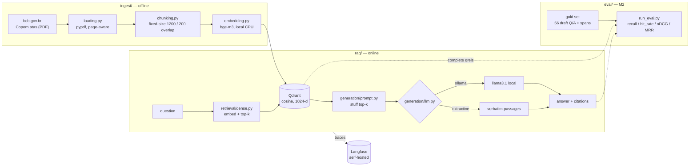

# rag-eval

**A production-grade RAG system over Brazilian financial regulatory documents, built around an evaluation harness rather than a demo.**

The corpus is the public minutes of the **Copom** — the Brazilian Central Bank's monetary policy committee — 30 documents (`atas`) in Portuguese covering the Selic rate decisions from October 2022 to June 2026. Everything runs locally and costs nothing: local embeddings, a local vector store, a local LLM (or a no-LLM extractive mode — see below), self-hosted tracing. There is no paid API and no API key anywhere in this repo.

The point of the project is not the RAG pipeline. Plenty of those exist. The point is the part almost all of them skip: **measuring whether it actually works**, separately for retrieval and generation, with a versioned gold set and an ablation that proves each component earns its place. This repo also doubles as the core of a master's thesis.

> Current milestone: **M2 — eval harness + gold set.** The naive baseline from M1 is
> now measured rather than described: **hit_rate@10 = 0.531, MRR = 0.191** over 49
> answerable gold questions. It is deliberately unoptimised, and that is the number
> the rest of the project has to beat.

---

## Architecture



Repository layout follows the project spec (`docs/spec.md`):

| path | role |
|---|---|
| `ingest/` | corpus download, PDF loading, chunking, embedding |
| `retrieval/` | Qdrant access; dense retriever (hybrid + reranking arrive in M4) |
| `generation/` | prompt, LLM backends, cited answers |
| `rag/` | config, tracing, the pipeline, the CLI |
| `eval/` | gold dataset, retrieval metrics, the harness, reports |
| `serving/` | FastAPI + UI placeholder (M7) |
| `docs/` | the spec of record |

---

## Stack

| layer | choice | why |
|---|---|---|
| Vector store | **Qdrant** (Docker) | open, self-hosted, good metadata filtering for M4/M5 |
| Embeddings | **bge-m3** via `sentence-transformers` | multilingual, strong on Portuguese, runs on CPU |
| LLM | **Ollama** (`llama3.1`), with an extractive fallback | free, local, no vendor lock-in |
| Tracing | **Langfuse v2** (Docker) | open, self-hosted; v2 needs only Postgres |
| Config | `pydantic-settings` | one `.env`, no hardcoded hosts |

Everything above is free and runs on a laptop. The narrative angle is deliberate: *"open models, no vendor lock-in"* is a strength, not a compromise.

---

## Running it

### 1. Infrastructure

```bash
docker compose up -d
docker compose ps          # all three must report (healthy)
```

- Qdrant dashboard → <http://localhost:6333/dashboard>
- Langfuse → <http://localhost:3000> (login `local@rag-eval.dev` / `ragevallocal123`)

The Langfuse project and its API keys are auto-provisioned on first boot via
`LANGFUSE_INIT_*`, so tracing works without clicking through the UI.

### 2. Python environment

```bash
uv sync
cp .env.example .env      # optional; every default already points at the local stack
```

### 3. Corpus + ingest

```bash
uv run python -m ingest.pipeline --download 30
```

Downloads 30 Copom minutes into `data/raw/` (gitignored), writes the committed
`data/manifest.json`, chunks, embeds with bge-m3 on CPU, and upserts into Qdrant.
First run also pulls ~2 GB of model weights from HuggingFace. Re-running is
idempotent — already-downloaded PDFs are skipped.

Only the manifest is committed. The corpus is reproducible from it, so no binaries
enter git.

### 4. Ask

```bash
uv run python -m rag.ask "qual a decisao do Copom sobre a Selic?"
uv run python -m rag.ask --top-k 8 --show-passages "quais as expectativas do Focus para 2026?"
uv run python -m rag.ask --mode extractive --json "quem votou pela decisao da 279a reuniao?"
```

Flags: `--top-k`, `--mode {auto,ollama,extractive}`, `--show-passages`, `--json`,
`--no-trace`.

### 5. Measure

```bash
uv run python -m eval.run_eval --min-status draft --out eval/reports/baseline_dense.json
uv run pytest -q
```

Scores the retriever against the gold set and writes a JSON report with
per-query and aggregate `recall@k`, `hit_rate@k`, `nDCG@k` and `MRR`. Flags:
`--gold`, `--min-status {draft,validated}`, `--k 1,3,5,10`, `--out`, `--label`,
`--quiet`.

`--min-status` is the flag that matters. Today everything is `draft`, so
`--min-status draft` exercises the harness and `--min-status validated` returns
nothing (by design, and exit code 3). After the human validation pass, the same
command with `--min-status validated` produces the number that counts — the
validation is a re-run, not a rewrite.

Every call emits a Langfuse trace named `rag.ask` with a `retrieve` span (the ranked
hits) and a `generate` span (the answer and token usage), tagged with the prompt
version, embedding model, chunk settings and LLM backend — so a number can always be
traced back to the configuration that produced it.

---

## LLM mode: which one shipped

Two backends sit behind one interface (`generation/llm.py`):

- **`ollama`** — a local Ollama server. Free, no key, no cloud call.
- **`extractive`** — no language model at all. Returns the retrieved passages
  *verbatim*, each with its citation.

`--mode auto` (the default) probes Ollama once and degrades to extractive if it is
not reachable, so the same command works on any machine.

### What shipped in M1: **extractive mode**

Ollama itself **is installed** on the dev machine (`winget install Ollama.Ollama`,
v0.32.5, server reachable on `:11434`). What did not complete is the *model pull*:
both `llama3.1` (4.9 GB) and `qwen2.5:3b` (1.9 GB) download to ~95–97 % and then
stall with zero throughput, repeatedly, against an otherwise healthy connection —
the same machine pulled 7 GB of HuggingFace weights and 30 PDFs without trouble in
this same session. That is an environment problem, not a code problem, so it was not
worth grinding on.

So **M1 ships in extractive mode**, and every observation reported below was produced
with it. The
Ollama backend is fully implemented and exercised by the same interface; finishing it
is one successful command away:

```bash
ollama pull llama3.1               # or qwen2.5
uv run python -m rag.ask --mode ollama "..."   # --mode auto picks it up automatically
```

No code change is required — `build_llm("auto")` probes `:11434/api/tags` and
switches backends on its own.

The extractive backend is not a stopgap to be embarrassed about — it is the honest
floor for groundedness. A verbatim quote cannot hallucinate, so it is a useful
control arm in the M3 harness: it isolates *retrieval* quality from *generation*
quality, which is exactly the separation this project is built to measure.

---

## Current status

| milestone | state | evidence |
|---|---|---|
| **M0 — scaffolding** | done | `docker compose ps` reports Qdrant, Langfuse and Postgres `(healthy)` |
| **M0 — corpus** | done | 30 Copom minutes (Oct 2022 → Jun 2026), 194 text pages, in `data/manifest.json` |
| **M0 — ingest** | done | **636 chunks**, bge-m3 1024-d, embedded on CPU in ~135 s (4.7 chunks/s) |
| **M1 — baseline** | done | `rag.ask` answers end to end with citations |
| **M1 — tracing** | done | `rag.ask` traces visible in Langfuse with `retrieve` + `generate` spans |
| **M2 — gold set** | draft | **56 Q/A pairs**, 24 documents cited, **pending human validation** |
| **M2 — eval harness** | done | `eval/run_eval.py`; 88 unit tests on the metric math |
| **M2 — baseline measured** | done | `eval/reports/baseline_dense.json` — numbers below |
| M3 → M8 | not started | — |

### The measured baseline

`uv run python -m eval.run_eval --min-status draft`, dense retrieval only,
bge-m3, 636 chunks, 49 answerable gold rows (7 abstention negatives excluded),
macro-averaged:

| metric | @1 | @3 | @5 | @10 |
|---|---|---|---|---|
| `recall` | 0.053 | 0.085 | 0.149 | 0.194 |
| `hit_rate` | 0.082 | 0.204 | 0.367 | **0.531** |
| `nDCG` | 0.071 | 0.098 | 0.138 | 0.161 |

**MRR = 0.191.**

Read `hit_rate@10` first: **for 47% of the gold questions, ten retrieved chunks
contain nothing relevant at all.** `recall@k` is lower still because a gold span
typically spans several chunks, so it is capped by construction at small `k` —
that is why both are reported.

This is a bad baseline, and it is the finding. M1 predicted the failure mode
qualitatively; M2 puts a number on it. The breakdown says the same thing more
precisely (`by_capability` in the report):

- `numeric extraction, two values` — hit@10 **0.333** (n=3). The Focus-expectation
  paragraph is phrased near-identically in all 30 atas, so dense similarity has
  almost nothing to discriminate on.
- `numeric extraction, near-duplicate of gold-004` — hit@10 **0.000** (n=1). That row
  exists specifically to ask the same question one meeting earlier. It fails.
- `reverse lookup (value → meeting)` — hit@10 **0.500** (n=6).
- `multi-hop within one document (pages 3 and 6)` — hit@10 **0.000** (n=2).
- `single-hop lookup, non-standard phrasing` — hit@10 **1.000**, MRR 1.000 (n=1).
  The one ata that words its decision differently is the one retrieved perfectly,
  which is the same story from the other side.

Dense similarity finds the right *topic* and is blind to the *date*, because every
ata phrases these paragraphs almost identically. That is now a concrete, measured
target for M4 — metadata filtering on `reference_date`, hybrid retrieval so the
meeting number is matched lexically, and reranking — each of which has to show a
delta against the table above.

**Caveat, and it is not a small one:** these numbers are computed against a gold
set no human has validated. They measure that the harness works end to end. They
do not yet measure the system. `--min-status validated` is what will.

### What is deliberately naive

M1 is the baseline, so it does the dumbest reasonable thing at every step:

- **Fixed-size character chunking** (1200 chars, 200 overlap), split per page so every
  chunk can cite a page number. No semantic or structural splitting.
- **Dense retrieval only.** No BM25, no hybrid fusion, no reranking, no query rewriting.
- **Stuff-the-context prompting.** Top-k passages concatenated, one shot, temperature 0.
- **No metadata used at query time.** `reference_date` is indexed and ignored, which
  is precisely what the numbers above punish.

Each of those is a knob M4 turns one at a time, with a measured delta. That ablation
is the scientific core of the project — not the pipeline itself.

---

## The gold set, and the one thing an agent must not do

`eval/datasets/gold_seed.jsonl` holds **56 draft Q/A pairs** citing 24 of the 30
documents: single-hop lookup, numeric extraction (Focus expectations, the Copom's
own projections, reference-scenario assumptions), list extraction including both
halves of a 5–4 split vote, multi-hop within a document, 8 reverse-lookup probes
and 7 out-of-scope negatives.

Every span was extracted from the actually ingested text and re-verified
programmatically before being written: the span must be locatable in a chunk of
its document on its page, the `source_doc_id` must exist in `data/manifest.json`,
the title must match the manifest verbatim. So the rows are **grounded**.

They are not **validated**, and the distinction is the whole point. A span can be
real and the question built on it still be ambiguous, mis-scoped, or answerable
from three other atas. Checking that is a human job — Rodrigo's — and it is the
scientific asset of this project. An agent-written, agent-graded gold set measures
nothing, so `"status": "validated"` is a flag no agent sets; there is a test in
`tests/test_gold.py` that fails if one ever does.

The protocol is in `eval/datasets/README.md`. Until it has been run, every number
in this README is a harness smoke test wearing a lab coat.

Roadmap: **M3** generation metrics + calibrated LLM-judge → **M4** ablation
(hybrid, reranking, chunking, date filtering) → **M5** guardrails and governance
→ **M6** CI regression gate → **M7** serving → **M8** writeup.

---

## Data and licensing

Corpus: *Atas do Copom*, published by the Banco Central do Brasil at
[bcb.gov.br](https://www.bcb.gov.br/publicacoes/atascopom) — public information,
free to use. `data/manifest.json` records the URL, title, reference date and SHA-256
of every document, so the corpus is reproducible without redistributing it.

Code: MIT.
